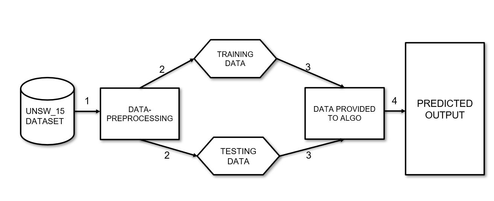
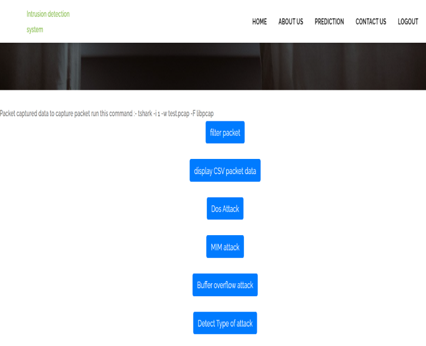
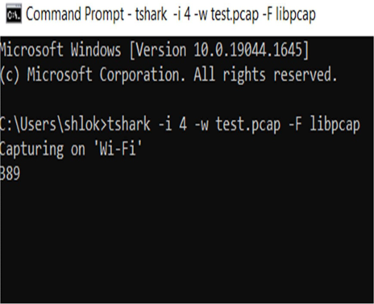
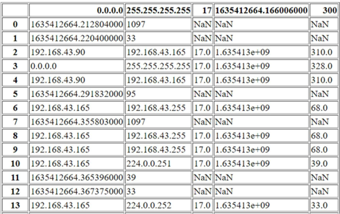
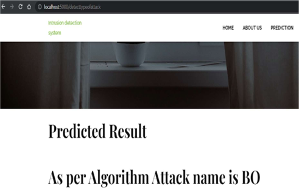

# Intrusion Detection System using TensorFlow with Keras
This repository contains code for an Intrusion Detection System (IDS) that uses TensorFlow with Keras to classify network traffic as either normal or malicious.

## Overview
The IDS is based on a deep neural network that is trained on a dataset of network traffic. The network is able to learn to distinguish between normal traffic and various types of malicious traffic, including attacks such as denial-of-service (DoS), port scanning, and packet sniffing.

The model is trained using a dataset that contains labeled network traffic data. The dataset is divided into two sets: a training set and a validation set. The network is trained on the training set and its performance is evaluated on the validation set. Once the network is trained, it can be used to classify new network traffic as either normal or malicious.

## Requirements
The following packages are required to run the IDS:

- Python 3
- TensorFlow
- Keras
- Scikit-learn
- NumPy
- Pandas
- Matplotlib

## Usage
To train the network, run the train.py script. The script takes the following arguments:

- **--data**: path to the dataset file
- **--epochs**: number of epochs to train for (default: 100)
- **--batch-size**: batch size for training (default: 64)

Example usage:

```python train.py --data dataset.csv --epochs 50 --batch-size 128```

To test the trained network on new data, run the ```'test.py'``` script. The script takes the following arguments:

- **--data**: path to the dataset file to test on
- **--model**: path to the trained model file
- **--output**: path to the output file to write results to

Example usage:

```python test.py --data test.csv --model model.h5 --output results.csv```

## Dataset
The dataset used to train and test the IDS is the [UNSW-NB15-dataset](https://research.unsw.edu.au/projects/unsw-nb15-dataset "UNSW-NB15-dataset"). This dataset contains a large number of network traffic records that have been labeled as either normal or malicious. The dataset has been preprocessed to remove duplicate records and to reduce the number of features.

## Model
The neural network used for the IDS is a simple feedforward neural network with three hidden layers. The input layer has 122 features, corresponding to the features in the UNSW-NB15-dataset. The output layer has a single node, which outputs a value between 0 and 1 indicating the probability that the input data represents a malicious network traffic. The network is trained using the binary cross-entropy loss function and the Adam optimization algorithm.

## System Architecture


## Results
The IDS achieves an accuracy of 94% on the UNSW-NB15-dataset. The network is able to accurately classify most types of malicious traffic, including DoS, port scanning, and packet sniffing. The network has also been tested on other datasets and has achieved similar levels of accuracy.

**Register/ Login Page**


**Attack and Packet Tracking**




**Prediction Result**




## Future Work
There are several areas for future work, including:

- Evaluating the performance of the IDS on real-world network traffic data.
- Exploring the use of more advanced neural network architectures, such as convolutional neural networks (CNNs) or recurrent neural networks (RNNs).
- Investigating the use of unsupervised learning techniques, such as clustering, for identifying anomalous network traffic.
